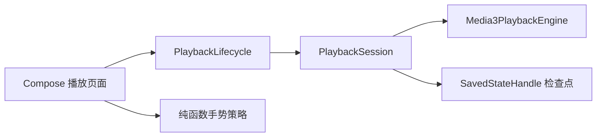
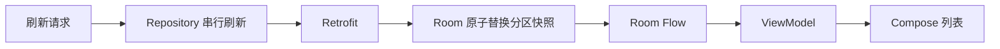

# 工程说明与简历表述

实际执行结果见 [验证记录](verification.md) 和 [性能基线](performance/README.md)。

## 播放所有权



`PlaybackSession` 拥有播放器，页面绑定播放视图。停止前保存进度与播放意图并释放解码器，返回前台重新创建并恢复；同一媒体切换全屏不重新 prepare。页面重建的设备回归、SavedStateHandle 数据恢复单测均已提供；这不等于验证了所有系统杀进程或强制停止场景。

实现：`domain/playback/PlaybackSession.kt`、`PlaybackGestures.kt`、`ui/playback/LocalPlaybackViewModel.kt`。上述路径均位于 `app/src/main/java/com/example/dilidiliactivity/`。

## 数据链路



分区成员与排序单独保存在 `archive_feed_entries`；事务内写实体、清旧成员、写新成员。失败不删除已有列表，不再维护与数据库可能冲突的内存副本。当前为快照刷新，不虚构分页游标。明确支持数据库版本 2 → 3 保留数据迁移；版本 1 未提供历史 schema，不能声称已验证迁移。

## 简历可用表达

- 抽离 Media3 播放会话与可替换播放器接口，统一媒体选择、前后台释放与播放检查点保存；使用 Fake Player 与设备回归验证恢复暂停状态、重建后进度及退出释放，并隔离过期异步请求。
- 将进度、音量、亮度和临时倍速交互拆成可测试策略，覆盖未知时长、越界、方向锁定和取消恢复；拖动进度只在完成时提交 Seek。
- 以 Room Flow 驱动视频列表，通过事务替换分区快照和稳定标识去重，支持离线读取、失败保留旧数据及刷新合并；补充 HTTP 契约、事务回滚与保留数据迁移测试。
- 建立固定本地素材的启动、列表帧耗时与视频首帧测量入口；CI 配置包含单测、Lint、构建和模拟器回归。CI 是否远程运行成功以验证记录为准。

## 性能复现

```sh
ANDROID_SERIAL=<device> ./gradlew :benchmark:connectedBenchmarkAndroidTest
python3 scripts/measure_first_frame.py --apk app/build/outputs/apk/benchmark/app-benchmark.apk --serial <dedicated-device> --output docs/performance/first-frame.json
```

模拟器只用于验证测量流程，Macrobenchmark 需要额外传入 `-Pandroid.testInstrumentationRunnerArguments.androidx.benchmark.suppressErrors=EMULATOR`。真实性能对比应固定物理设备、系统、温度、电量和构建配置，并增加重复次数。首帧脚本会清空指定测试设备的 Logcat；不要指向正在收集其它日志的设备。

素材为自行生成的 6 秒 H264 测试图，无音轨：

```sh
ffmpeg -f lavfi -i 'testsrc2=size=320x180:rate=24' -t 6 -an -c:v libx264 -pix_fmt yuv420p -crf 28 -movflags +faststart app/src/main/res/raw/playback_fixture.mp4
```

官方参考：[Media3 生命周期](https://developer.android.com/media/media3/exoplayer/hello-world)、[状态保存](https://developer.android.com/topic/libraries/architecture/saving-states)、[Macrobenchmark 指标](https://developer.android.com/topic/performance/benchmarking/macrobenchmark-metrics)。
